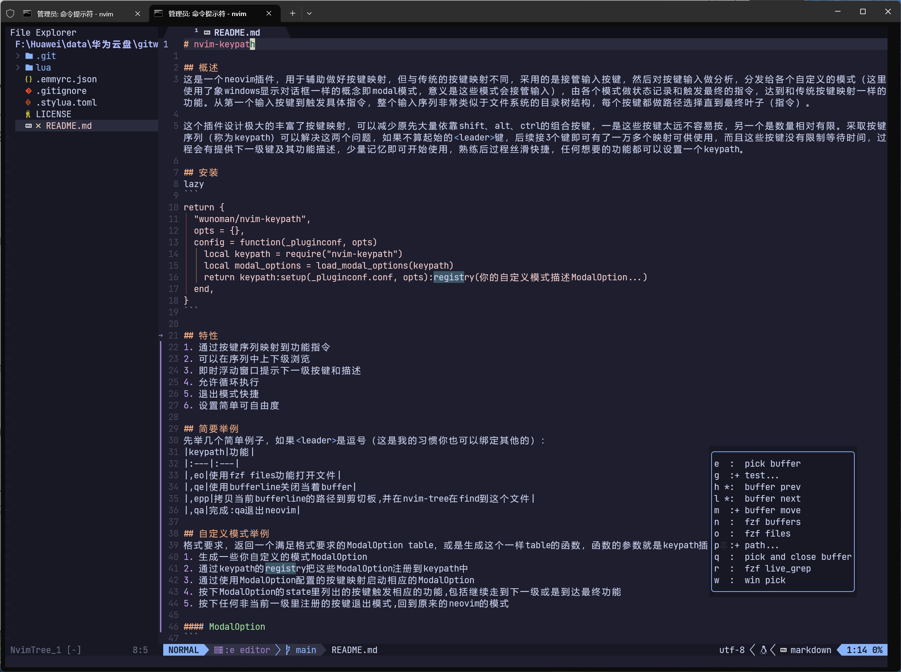

# nvim-keypath



## 概述
This is a Neovim plugin designed to assist with key mapping, but unlike traditional key mapping, it works by intercepting input keystrokes, analyzing the key input, and distributing them to various custom modes (using a concept similar to Windows dialog boxes, referred to as "modal" modes, which take over the input). Each mode maintains its own state and triggers the final commands, achieving the same functionality as traditional key mapping. From the first input keystroke to triggering a specific command, the entire input sequence closely resembles the directory tree structure of a file system, where each keystroke navigates a path until reaching the final leaf node (the command).

This plugin design greatly enriches key mapping and can reduce the reliance on numerous combinations involving Shift, Alt, and Ctrl keys—partly because these keys are often difficult to reach, and partly because their quantity is relatively limited. Adopting key sequences (referred to as "keypaths") addresses both issues. Excluding the initial <leader> key, just three subsequent keys can provide over ten thousand possible mappings. Moreover, there is no time limit for waiting between keystrokes, and hints for the next available keys and their functions are provided during the process. With minimal memorization, users can start using it right away, and once proficient, the workflow becomes smooth and efficient. Any desired function can be assigned a keypath.

With nvim-keypath, achieve both mapping freedom and finger freedom.

这是一个neovim插件，用于辅助做好按键映射，但与传统的按键映射不同，采用的是接管输入按键，然后对按键输入做分析，分发给各个自定义的模式（这里使用了象windows显示对话框一样的概念即modal模式，意义是这些模式会接管输入），由各个模式做状态记录和触发最终的指令，达到和传统按键映射一样的功能。从第一个输入按键到触发具体指令，整个输入序列非常类似于文件系统的目录树结构，每个按键都做路径选择直到最终叶子（指令）。

这个插件设计极大的丰富了按键映射，可以减少原先大量依靠shift、alt、ctrl的组合按键，一是这些按键太远不容易按，另一个是数量相对有限。采取按键序列（称为keypath）可以解决这两个问题，如果不算起始的<leader>键，后续接3个键即可有了一万多个映射可供使用，而且这些按键没有限制等待时间，过程会有提供下一级键及其功能描述，少量记忆即可开始使用，熟练后过程丝滑快捷，任何想要的功能都可以设置一个keypath。

使用 nvim-keypath 实现映射键自由，也实现手指自由。

## 安装
lazy.nvim
```
return {
  "wunoman/nvim-keypath",
  opts = {
    options = { ... 写上你的自定义配置 ... },
  },
  config = function(pluginconf, opts)
    local keypath = require("nvim-keypath")
    return keypath:setup(pluginconf, opts):registry(
      你的自定义模式描述ModalOption或是各个能生成ModalOption的脚本路径...)
  end,
}
```

## 基本概念
1. 每个按键都是keypath中的一个节点，触发具体功能或是继续走向下一个节点
2. 每个注册到keypath中都称为自定义模式，每个自定义模式至少有一个ModalState，可以有多个
3. 当某个节点提供了state属性，则会跳转到这个state，这个state是当前state的下一级，但它们同属于一个自定义模式
4. nvim-keypath有一个root的自定义模式，它展示了当前已经注册了的其他自定义模式，默认启动按键是\<leader\>
5. nvim-keypath默认开启返回上一级节点的功能，默认按键为减号
6. 按下的键如果不属于任何下一级节点，则退出

## 特性
1. 通过按键序列映射到功能指令
2. 可以在序列中上下级浏览（如果有提供相应的ModalHandle配置的话）
3. 即时浮动窗口提示下一级按键和描述
4. 允许循环执行，允许一直停留在当前这一级
5. 退出模式快捷，任何非下一节点的按键都可以是退出键
6. 设置简单可自由度，可使用simulate_keypath或是:normal 函数模拟输入keypath以调用节点指向的功能
7. 默认开启可返回上一级模式,缺省按键是减号

## 简要举例
先举几个简单例子，如果\<leader\>是逗号（这是我的习惯你也可以绑定其他的）。可以查看test目录下列有几个。
|keypath|功能|
|:---|:---|
|,eo|使用fzf files功能打开文件|
|,qe|使用bufferline关闭当着buffer|
|,epp|拷贝当前bufferline的路径到剪切板,并在nvim-tree在find到这个文件|
|,qa|完成:qa退出neovim|

## 自定义模式举例
格式要求，返回一个满足格式要求的ModalOption table，或是生成这个一样table的函数，函数的参数就是keypath插件本身
1. 生成一些你自定义的模式ModalOption
2. 通过keypath的registry把这些ModalOption注册到keypath中
3. 通过使用ModalOption配置的按键映射启动相应的ModalOption
4. 按下ModalOption的state里列出的按键触发相应的功能,包括继续走到下一级或是到达最终功能
5. 按下任何非当前一级里注册的按键退出模式,回到原来的neovim的模式

#### ModalOption
```
---@class ModalOption
---@field name string @自定义模式名称,做为inventory的键
---@field state ModalState @模式中接受的按键
---@field keymap ModalHandlerRegistryKeymap
---@field on_registry On_registry? @注册至仓库里的回调函数
---@field on_key On_key? @完全自助处理按键事件
---@field current_state table|? @指定当前的按键处理组,一个自定义模式下可能有多个 ModalState
---@field show_which_key Show_which_key|? @显示提示的浮动窗口
---@field _enter function|? @内置函数
```
- 必填内容：
1. name 全局唯一的模式名称,keypath用于区别各个模式
2. state 按键对应的指令描述表ModalState，键为各个输入字符，值为指令描述
3. keymap 触发模式的传统按键映射

#### ModalState

```
---@alias ModalState table{ [string]:ModalHandler, handler:Handle_key_typed? }
```
ModalState是由ModalHandler组成一个表
```
---@class ModalHandler
---@field desc string @功能描述
---@field handle string|function @字符串形式的命令或是按键序列或是自定义函数
---@field state ModalState @是否要转到其他 ModalState
---@field condition boolean|function|? @判断是否生效
```
- 如果设置了state，则表示它有下一级
- 如果设置了condition并且评估结果为假则该指令不会显示也没有作用
- 如果handle是简单的按键序列则用字符串表示该序列，如果为复杂功能则可以用函数表示并返回结果

返回结果(modal.handle_result.xxx)为枚举让keypath决定要如何做下一步处理
```
  handle_result = {
    bypass = 0, -- 表示按键继续传播让neovim处理它
    feedkey = 1, -- 表示向输入序列中写入一定数量的按键
    leavemodal = 2, -- 表示执行完后即退出模式
    feedandleave = 3, -- 表示有向输入序列写入按键并且要退出模式
    discarded = 4, -- 表示抛弃掉输入
    bypassandleave = 5, -- 表示按键继续传播并且退出模式
  },
```


#### 简单ModalOption例子
core.modal.modal-q.lua
```
----------------------------------------------------------------------------------------------------
local utils = require("core.utils")
----------------------------------------------------------------------------------------------------
-- 有些需要某插件存在才有效
local status_fix_bufferline, fix_bufferline = utils.require("core.fix-bufferline")

----------------------------------------------------------------------------------------------------
local function create_state(_modal)
  ---@ModalState
  local q = {
    a = {
      desc = "exit qa",
      handle = function()
        if status_fix_bufferline and "table" == type(fix_bufferline) then
          fix_bufferline:disable() -- 暂停拦截:q命令
          vim.cmd("qa")
          fix_bufferline:enable()
        else
          vim.cmd("qa")
        end
      end,
    },
    e = {
      desc = "quit current buffer",
      handle = "<cmd>q<cr>",
    },
    s = {
      desc = "clear selection",
      handle = "<cmd>let @/=''<cr>",
    },
  }
  return q
end

----------------------------------------------------------------------------------------------------
---@GenerateModalOption
return function(modal)
  ---@type ModalOption
  return {
    name = ":q quit",
    state = create_state(modal),
    keymap = { "n", "<leader>q", { desc = "q" } },
  }
end
----------------------------------------------------------------------------------------------------
```

#### 注册自定义模式到keypath中
```
require("nvim-keypath")
  :setup(configure, {})
  :registry("core.modal.modal-q")
```

#### 循环执行的ModalHanle配置
实现:bp，用的是bufferline的commands功能，到达路径后每按一个h都会执行，一直停留在自定义模式中直到有退出键被按下。如果条件不满足，这里没有使用condition，则是输出一个提示并退出模式。

在ModalState中每个单个字符为键的值都称为ModalHandler，由它执行具体的功能或是走向下一级。

如果是走向下一级，则给ModalHandler配置一个state属性即可，这个state又是一个ModalState类型的表
```
    h = {
      desc = "buffer prev",
      handle = function()
        if "table" == type(buffer_commands) then
          buffer_commands.cycle(-1)
          return modal.handle_result.discarded
        else
          vim.notify(tostring(buffer_commands))
          return modal.handle_result.leavemodal
        end
      end,
      option = { keep = true },
    },
```
如果使用condition则可改写成，如果条件不满足则h这一级不会显示有提示窗口中。因为使用了返回值discarded则当前输入被从输入序列中移除，相当于没有任何输入，并且不会离开当前模式，这时候再按下h键，则再按一遍相同的指令，即是代码里描述的显示前一个buffer。
```
    h = {
      desc = "buffer prev",
      handle = function()
          buffer_commands.cycle(-1)
          return modal.handle_result.discarded
      end,
      condition = "table" == type(buffer_commands)
      option = { keep = true },
    },
```

## 与 lualine 结合显示当前的自定义模式名称

在配置 lualine 时把 keypath 的 component 添加到 lualine_b 中，使用 keypath 的get_status_component() 返回 component 配置
```
    local lualine_b = {
      "branch",
      "diff",
      "diagnostics",
    }
    local status_keypath, keypath = utils.require("nvim-keypath")
    if status_keypath and keypath then
      ---@diagnostic disable-next-line
      table.insert(lualine_b, 1, keypath:get_status_component())
    end
```

在 options 在配置响应切换事件，实现快速启动 lualine 刷新

```
local utils = require("core.utils")
local keypath = require("nvim-keypath")
keypath
  :setup(configure, {
    options = {
      event = {
        set_state = function(_keypath, _state)
          -- 立即更新状态栏
          local status_lualine, lualine = utils.require("lualine")
          if status_lualine and "table" == type(lualine) then
            lualine.refresh()
          end
        end,
      },
    },
  })
  :registry("core.modal.modal-q") 
```

## 事件回调函数

允许实现更多的定制化功能

- set_state 第一个参数是keypath插件本向，第二个参数是进行的ModalState（如果是进入的话，否则是nil）
  self:trigger_event("set_state", state)
- show_which_key
  hintline = self:trigger_event("show_which_key", self, custom_modal, state, k, v)
- is_custom_modal
  return not not self:trigger_event("is_custom_modal", modal_name)

## 历史
- 20260101 建立

## License
+ Licensed under the [MIT License](https://www.lua.org/license.html).
